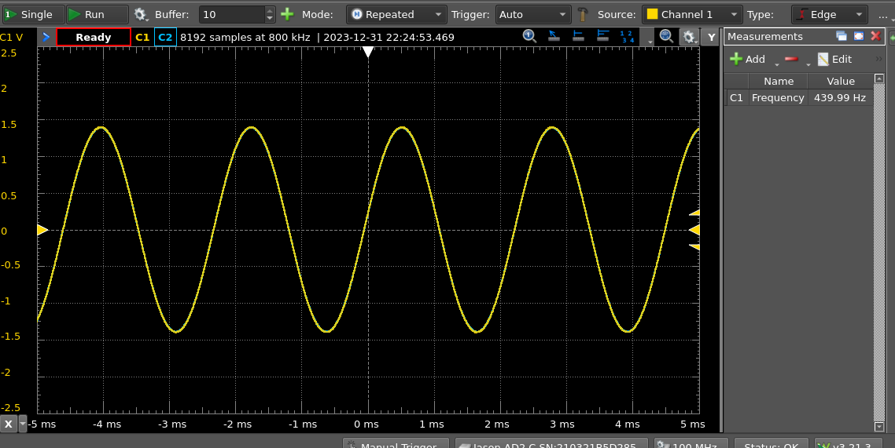
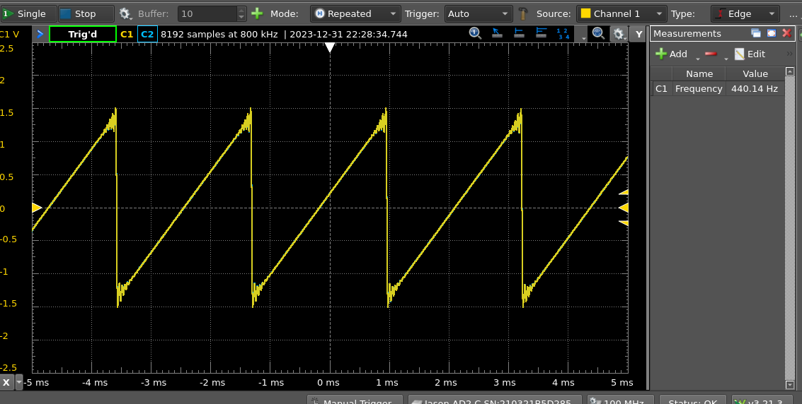

# Test Oscillators
There are 2 test oscillators in each template.  These can be used to ensure that the board and Audio DAC are working correctly.

- sine approximation (440Hz)
- sawtooth (440Hz)

If you have a DSO, the output from these should look like:

